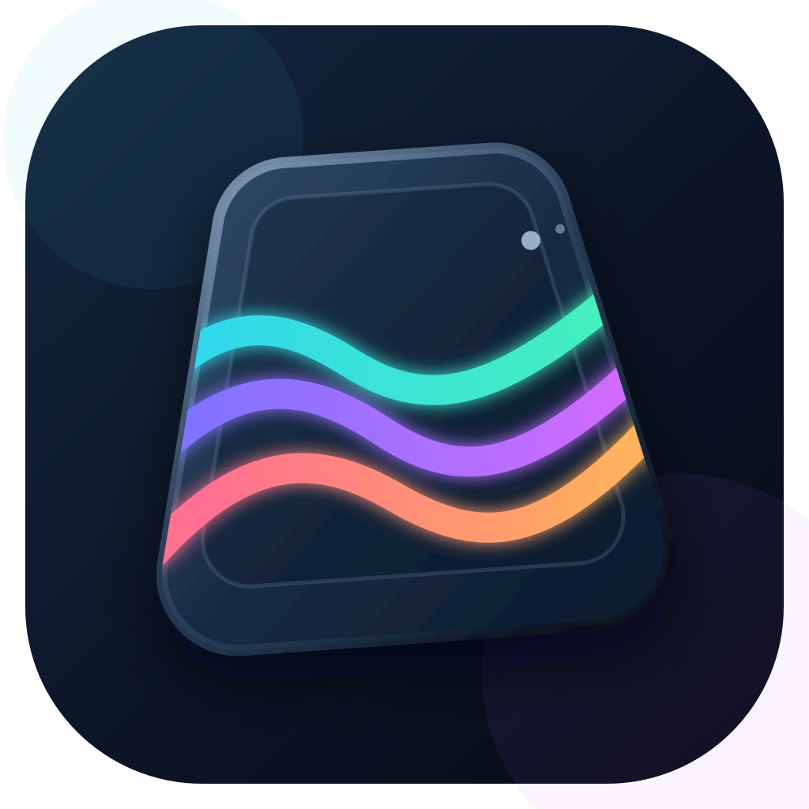

# KeyCanvas

ARCHON AK47 non-PRO를 macOS에서 설정하기 위한 비공식 오픈소스 앱입니다.

> **현재 프로그램은 실험적 기능임에 따라 장치 이상, 고장이 발생 할 수 있음을 인지하고 있습니다.**

## 경고

1. KeyCanvas는 제조사 공식 프로그램이 아닌 개인 개발 실험판이며, 확인된 ARCHON AK47 non-PRO 유선 USB 장치에서만 제한적으로 동작합니다.
2. 장치의 현재 설정과 LCD 내용을 완전히 읽거나 백업·자동 복원·롤백할 수 없으며, 오류나 전원·연결 중단으로 데이터가 손상될 수 있습니다.
3. 장치에 적용하기 전 제조사 프로그램, Windows 가상 머신과 다른 USB/HID 도구를 모두 종료하고 화면의 확인 절차를 끝까지 따라야 합니다.

## 현재 지원

### 로컬 기능

- macOS 13 이상, Apple Silicon 및 Intel Mac, 한국어·영어 UI
- Base/Fn 키맵과 매크로 초안의 로컬 편집, 로컬 프로필 및 JSON 가져오기·내보내기
- 19개 내장 조명 효과 미리보기와 84키 RGB 편집
- PNG·JPEG·GIF 및 MP4·MOV·M4V 불러오기, 영상 미리보기·구간 선택, 최대 140프레임 편집
- 240×135 맞춤·채움·크롭·늘이기, 프레임·지연·텍스트·펜 편집, GIF·RGB565 내보내기
- Windows 프로그램이 저장한 로컬 프로필과 LCD 자산 가져오기

### 키보드 연결 기능

- 유선 ARCHON AK47 non-PRO (`0x0C45:0x800A`, revision `0x0115`) 연결 확인
- 현재 84키 RGB 조회, Mac 시각 동기화
- 선택한 내장 조명 효과와 완성된 84키 RGB 적용
- 앱의 장치 확인 절차를 완료한 동일 키보드에 1–40프레임 LCD 이미지·애니메이션 적용

## 개발 참여

버그 제보, 기능 제안과 코드 수정 방법은 [개발 참여 안내](CONTRIBUTING.md)를 확인해 주세요.

## 라이선스

KeyCanvas가 독자적으로 작성한 코드와 문서는 [MIT License](LICENSE)로 배포합니다.
